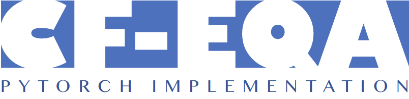

<br />
<p align="center">
  

  <p align="center">
  <strong>Counterfactual QA: Eliminating Bias in Question Answering</strong>
  </p>
</p>

<p align="center">
  <a href="https://github.com/ldkong1205/cf-eqa/blob/main/paper/CE7455__Project_Final.pdf">
    
  </a>
  <a href="https://github.com/ldkong1205/cf-eqa/blob/main/paper/slides.pdf">
    
  </a>
  <a href="">
    
  </a>
</p>

## About
This repository contains the Pytorch implementation of <a href="https://github.com/ldkong1205/cf-eqa/blob/main/paper/CE7455__Project_Final.pdf">Counterfactual QA: Eliminating Bias in Question Answering</a>.

CF-EQA is proposed to capture and mitigate position bias in extractive QA from the view of causal effect. CF-EQA enables us to capture the answer position bias as the direct causal effect of the passages on answers, and eliminate the bias by subtracting the direct causal effect from the total causal effect.


## Content

* [Installation](#installation)
    * [Setup and Dependency](#1-setup-and-dependencies)
    * [Datasets](#2-download-datasets)
* [Quick Start](#quick-start)
    * [Train a Model](#train-a-model)
    * [Evaluate a Model](#evaluate-a-model)
* [Useful Command](#useful-commands)
* [Acknowledgment](#acknowledgment)
* [References](#acknowledgment)

## Installation

### 1. Setup and Dependency

Install `Anaconda` or `Miniconda` distribution based on `Python 3+` from their downloads' site.

```
bash
conda create --name cfqa python=3.7
conda activate cfqa
conda install pytorch==1.5.0 torchvision==0.6.0 cudatoolkit=10.1 -c pytorch
pip install -r requirements.txt
```

Note that `PyTorch` has to be installed depending on the version of `CUDA`.

### 2. Dataset

We adopt `SQuAD-v1.1` and its bias subsets from [SQuAD][3] and [position-bias][1].

<table >
	<tbody>
		<tr>  
			<td> <b> Dataset </td>
			<td> <b> Answer Position </td>
		</tr>
		<tr>
			<td> SQuAD-v1.1-train.json </td>
			<td> Full training set </td>
		</tr>
		<tr>
			<td> SQuAD-train-1st.json </td>
			<td> First sentence </td>
		</tr>
		<tr>
			<td> SQuAD-train-2nd.json </td>
			<td> Second sentence </td>
		</tr>
		<tr>
			<td> SQuAD-train-3rd.json </td>
			<td> Third sentence </td>
		</tr>
		<tr>
			<td> SQuAD-train-4th.json </td>
			<td> Fourth sentence </td>
		</tr>
		<tr>
			<td> SQuAD-train-5th.json </td>
			<td> Fifth & later sentences  </td>
		</tr>
		<tr>
			<td> SQuAD-v1.1-dev.json </td>
			<td> Full test set </td>
		</tr>
	</tbody>
</table>

## Quick Start

### 1. Train a Model
To train Bias Product on the synthetic `SQuAD` subsets, simply run the following.

```
sh train.product.sh
```

To train Learned-Mixin on the synthetic `SQuAD` subsets, simply run the following.

```
sh train.learned_mixin.sh
```

### 2. Evaluate a Model
To evaluate Bias Product on `SQuAD`, `SQuAD (k=1)`, and `SQuAD (k=2,3,...)`, simply run the following.

```
sh test.product.sh
```

To evaluate Learned-Mixin on `SQuAD`, `SQuAD (k=1)`, and `SQuAD (k=2,3,...)`, simply run the following.

```
sh test.learned_mixin.sh
```

## Useful Command
Coming soon.

## Acknowledge

Special thanks to the authors of [position-bias][1], [CF-VQA][2], and [SQuAD][3].


## References

* Miyoung Ko, Jinhyuk Lee, Hyunjae Kim, Gangwoo Kim, and Jaewoo Kang. "Look at the first sentence: Position bias in question answering," *EMNLP*, 2020.
* Yulei Niu, Kaihua Tang, Hanwang Zhang, Zhiwu Lu, Xian-Sheng Hua, and Ji-Rong Wen. "Counterfactual VQA: A cause-effect look at language bias." *CVPR*, 2021.
* Pranav Rajpurkar, Jian Zhang, Konstantin Lopyrev, and Percy Liang. "SQuAD: 100,000+ questions for machine comprehension of text," *EMNLP*, 2016.
* Christopher Clark, Mark Yatskar, and Luke Zettlemoyer. "Don’t take the easy way out: Ensemble based methods for avoiding known dataset biases." *EMNLP*, 2019.
* Remi Cadene, Corentin Dancette, Hedi Ben-younes, Matthieu Cord, and Devi Parikh. "RUBi: Reducing unimodal biases for visual question answering," *NeurIPS*, 2019.


[1]: https://github.com/dmis-lab/position-bias
[2]: https://github.com/yuleiniu/cfvqa
[3]: https://rajpurkar.github.io/SQuAD-explorer/
